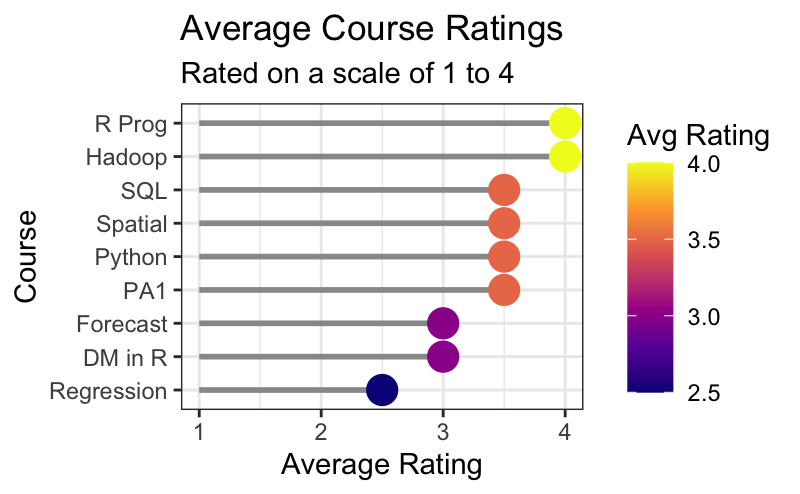
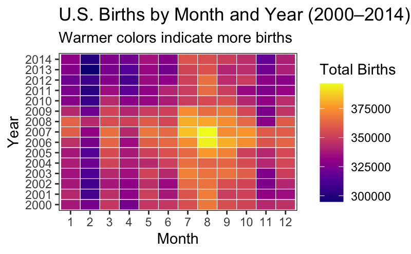

# Data Visualization and Reproducible Research

> Oettly Etienne. 

The following is a sample of products created during the _"Data Visualization and Reproducible Research"_ course.

## Project 01

In the `project_01/` folder you can find a revised analysis of a course 
rating dataset collected from 15 students across 9 courses at Florida 
Polytechnic University. The project explores rating distributions, student 
participation, and course comparisons using a heatmap, lollipop chart, 
box plot, and participation bar chart.

**Sample data visualization:**

## Project 02

In this project, I explored U.S. daily birth data from 2000 to 2014. 
The analysis includes an interactive line chart of total births per year, 
a heatmap of births by month and year revealing seasonal patterns and the 
post-2007 decline, and a faceted linear model coefficients plot showing 
the effect of year, month, and day of week on daily birth counts. Find 
the code and report in the `project_02/` folder.

**Sample data visualization:**

## Project 03

In this project, I explored the distribution of daily maximum temperatures 
at Tampa International Airport in 2022 using density plots, faceted 
histograms, and a ridgeline plot with the viridis plasma palette. The 
second part analyzes Billboard Top 100 lyrics from 2015 using sentiment 
analysis and word frequency visualizations.

**Sample data visualization:**

### Moving Forward

I learned a lot about data visualization this semester and gained a solid 
understanding of how to create different types of graphs using ggplot2 in R. 
More importantly, I learned that choosing the right chart type and design 
matters as much as the data itself; small decisions like color palettes, 
axis labels, and annotations can completely change how a reader interprets 
a visualization. I would like to continue exploring data storytelling and 
reproducible research, particularly how to communicate findings clearly to 
audiences who may not have a technical background.