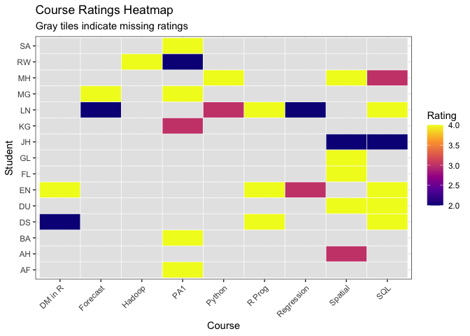
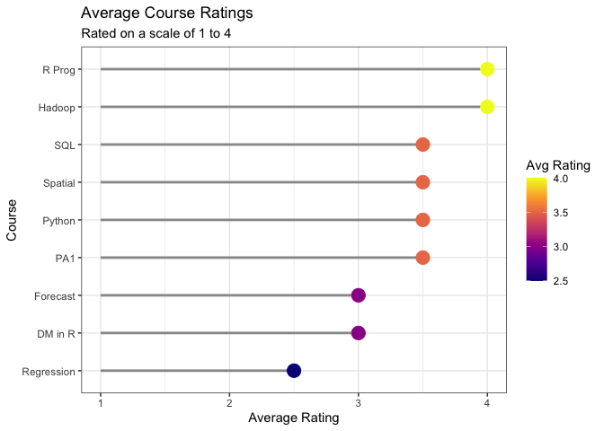
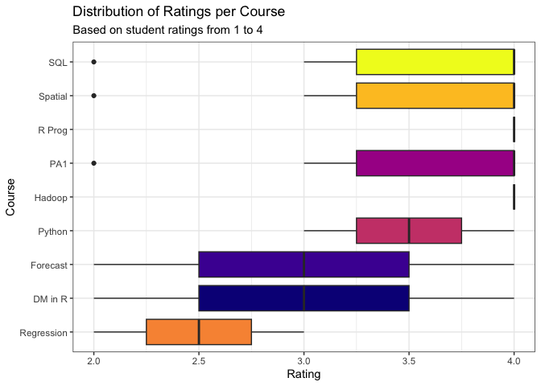
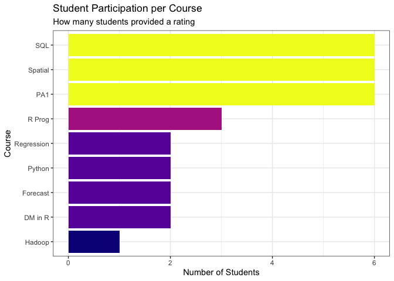

# Data Visualization Project 01 revised version


## Visualization


``` r
course_long %>%
  ggplot(aes(x = course, y = student, fill = rating)) +
  geom_tile(color = "white") +
  scale_fill_viridis_c(option = "plasma", na.value = "gray90",
                       name = "Rating") +
  labs(
    x = "Course",
    y = "Student",
    title = "Course Ratings Heatmap",
    subtitle = "Gray tiles indicate missing ratings"
  ) +
  theme_bw() +
  theme(axis.text.x = element_text(angle = 45, hjust = 1))
```

<!-- -->


``` r
course_long %>%
  group_by(course) %>%
  summarize(avg_rating = mean(rating, na.rm = TRUE)) %>%
  ggplot(aes(x = reorder(course, avg_rating), y = avg_rating)) +
  geom_segment(aes(xend = course, y = 1, yend = avg_rating), 
               color = "gray60", linewidth = 1) +
  geom_point(aes(color = avg_rating), size = 5) +
  scale_color_viridis_c(option = "plasma", name = "Avg Rating") +
  coord_flip() +
  labs(
    x = "Course",
    y = "Average Rating",
    title = "Average Course Ratings",
    subtitle = "Rated on a scale of 1 to 4"
  ) +
  theme_bw()
```

<!-- -->


``` r
course_long %>%
  filter(!is.na(rating)) %>%
  ggplot(aes(x = reorder(course, rating, median), y = rating, fill = course)) +
  geom_boxplot() +
  scale_fill_viridis_d(option = "plasma") +
  guides(fill = "none") +
  coord_flip() +
  labs(
    x = "Course",
    y = "Rating",
    title = "Distribution of Ratings per Course",
    subtitle = "Based on student ratings from 1 to 4"
  ) +
  theme_bw()
```

<!-- -->


``` r
course_long %>%
  filter(!is.na(rating)) %>%
  count(course) %>%
  ggplot(aes(x = reorder(course, n), y = n, fill = n)) +
  geom_col() +
  scale_fill_viridis_c(option = "plasma") +
  guides(fill = "none") +
  coord_flip() +
  labs(
    x = "Course",
    y = "Number of Students",
    title = "Student Participation per Course",
    subtitle = "How many students provided a rating"
  ) +
  theme_bw()
```

<!-- -->

## Report

This report analyzes a course rating dataset collected from 15 students 
across 9 different courses. Ratings are 
measured on a scale from 1 to 4, and missing values indicate that some 
students did not rate every course.

### Findings

The heatmap reveals that missing ratings are widespread. Most students 
only rated a small subset of courses, making direct comparisons across 
courses difficulty. SQL, Spatial, and PA1 received the most ratings (6 
students each), while Hadoop was rated by only 1 student.

The lollipop chart shows that R Prog and Hadoop have the highest average 
ratings (above 4.0), while Regression has the lowest (around 2.5). However, 
the box plot adds important context — Hadoop's high average is based on a 
single rating and should not be over-interpreted, while Regression's low 
ratings are consistent across all students who rated it, suggesting a 
genuine pattern rather than an outlier effect.

The box plot also reveals that SQL and Spatial show the widest spread of 
ratings, meaning students disagreed most about these courses. This level 
of variation would be completely invisible in a simple average.

### Design Decisions

All figures use the viridis plasma palette, which is colorblind-safe and 
perceptually uniform. Chart types were chosen to match the nature of each 
insight: a heatmap for the full data overview, a lollipop chart for 
ranked averages, a box plot for distributions, and a bar chart for 
participation counts.
