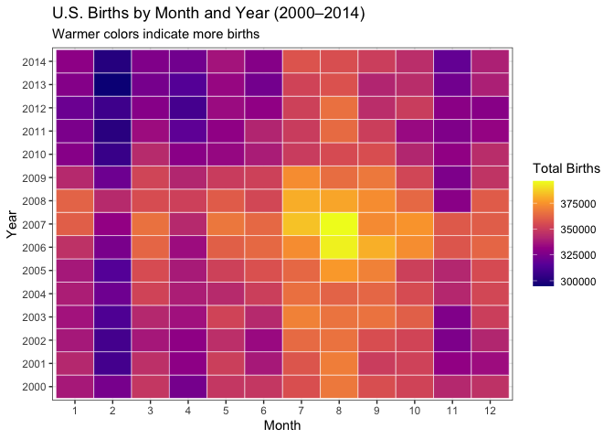
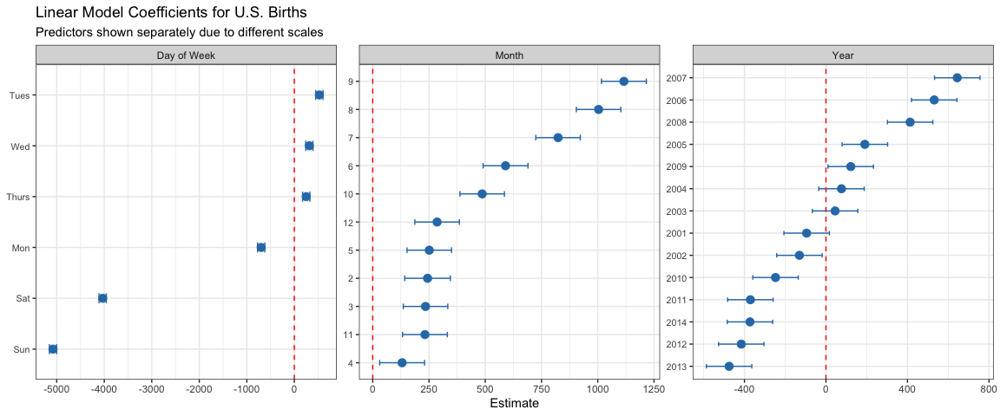

# Data Visualization Project 02 revised version


``` r
births_by_year <- births %>%
  group_by(year) %>%
  summarize(total_births = sum(births))

p <- ggplot(births_by_year, aes(x = year, y = total_births)) +
  geom_line(color = "#2c7bb6", linewidth = 1.2) +
  geom_point(color = "#2c7bb6", size = 3) +
  labs(  x = "Year",
         y = "Total Births") +
  theme_minimal()

interactive_plot <- ggplotly(p)
interactive_plot
```

```{=html}
<div class="plotly html-widget html-fill-item" id="htmlwidget-486bc06bd0e95dfb435f" style="width:672px;height:480px;"></div>
<script type="application/json" data-for="htmlwidget-486bc06bd0e95dfb435f">{"x":{"data":[{"x":[2000,2001,2002,2003,2004,2005,2006,2007,2008,2009,2010,2011,2012,2013,2014],"y":[4149598,4110963,4099313,4163060,4186863,4211941,4335154,4380784,4310737,4190991,4055975,4006908,4000868,3973337,4010532],"text":["year: 2000<br />total_births: 4149598","year: 2001<br />total_births: 4110963","year: 2002<br />total_births: 4099313","year: 2003<br />total_births: 4163060","year: 2004<br />total_births: 4186863","year: 2005<br />total_births: 4211941","year: 2006<br />total_births: 4335154","year: 2007<br />total_births: 4380784","year: 2008<br />total_births: 4310737","year: 2009<br />total_births: 4190991","year: 2010<br />total_births: 4055975","year: 2011<br />total_births: 4006908","year: 2012<br />total_births: 4000868","year: 2013<br />total_births: 3973337","year: 2014<br />total_births: 4010532"],"type":"scatter","mode":"lines+markers","line":{"width":4.5354330708661417,"color":"rgba(44,123,182,1)","dash":"solid"},"hoveron":"points","showlegend":false,"xaxis":"x","yaxis":"y","hoverinfo":"text","marker":{"autocolorscale":false,"color":"rgba(44,123,182,1)","opacity":1,"size":11.338582677165356,"symbol":"circle","line":{"width":1.8897637795275593,"color":"rgba(44,123,182,1)"}},"frame":null}],"layout":{"margin":{"t":23.305936073059364,"r":7.3059360730593621,"b":37.260273972602747,"l":66.484018264840202},"paper_bgcolor":"rgba(255,255,255,1)","font":{"color":"rgba(0,0,0,1)","family":"","size":14.611872146118724},"xaxis":{"domain":[0,1],"automargin":true,"type":"linear","autorange":false,"range":[1999.3,2014.7],"tickmode":"array","ticktext":["2000","2005","2010"],"tickvals":[2000,2005,2010],"categoryorder":"array","categoryarray":["2000","2005","2010"],"nticks":null,"ticks":"","tickcolor":null,"ticklen":3.6529680365296811,"tickwidth":0,"showticklabels":true,"tickfont":{"color":"rgba(77,77,77,1)","family":"","size":11.68949771689498},"tickangle":-0,"showline":false,"linecolor":null,"linewidth":0,"showgrid":true,"gridcolor":"rgba(235,235,235,1)","gridwidth":0.66417600664176002,"zeroline":false,"anchor":"y","title":{"text":"Year","font":{"color":"rgba(0,0,0,1)","family":"","size":14.611872146118724}},"hoverformat":".2f"},"yaxis":{"domain":[0,1],"automargin":true,"type":"linear","autorange":false,"range":[3952964.6499999999,4401156.3499999996],"tickmode":"array","ticktext":["4000000","4100000","4200000","4300000","4400000"],"tickvals":[4000000,4100000,4200000,4300000,4400000],"categoryorder":"array","categoryarray":["4000000","4100000","4200000","4300000","4400000"],"nticks":null,"ticks":"","tickcolor":null,"ticklen":3.6529680365296811,"tickwidth":0,"showticklabels":true,"tickfont":{"color":"rgba(77,77,77,1)","family":"","size":11.68949771689498},"tickangle":-0,"showline":false,"linecolor":null,"linewidth":0,"showgrid":true,"gridcolor":"rgba(235,235,235,1)","gridwidth":0.66417600664176002,"zeroline":false,"anchor":"x","title":{"text":"Total Births","font":{"color":"rgba(0,0,0,1)","family":"","size":14.611872146118724}},"hoverformat":".2f"},"shapes":[],"showlegend":false,"legend":{"bgcolor":null,"bordercolor":null,"borderwidth":0,"font":{"color":"rgba(0,0,0,1)","family":"","size":11.68949771689498}},"hovermode":"closest","barmode":"relative"},"config":{"doubleClick":"reset","modeBarButtonsToAdd":["hoverclosest","hovercompare"],"showSendToCloud":false},"source":"A","attrs":{"7fcc4de450bd":{"x":{},"y":{},"type":"scatter"},"7fcc4870d03e":{"x":{},"y":{}}},"cur_data":"7fcc4de450bd","visdat":{"7fcc4de450bd":["function (y) ","x"],"7fcc4870d03e":["function (y) ","x"]},"highlight":{"on":"plotly_click","persistent":false,"dynamic":false,"selectize":false,"opacityDim":0.20000000000000001,"selected":{"opacity":1},"debounce":0},"shinyEvents":["plotly_hover","plotly_click","plotly_selected","plotly_relayout","plotly_brushed","plotly_brushing","plotly_clickannotation","plotly_doubleclick","plotly_deselect","plotly_afterplot","plotly_sunburstclick"],"base_url":"https://plot.ly"},"evals":[],"jsHooks":[]}</script>
```

``` r
# Save as self-contained HTML
htmlwidgets::saveWidget(interactive_plot, 
                        "../figures/births_over_time.html",
                        selfcontained = TRUE)
```


``` r
births_heatmap <- births %>%
  group_by(year, month) %>%
  summarize(total_births = sum(births), .groups = "drop")

ggplot(births_heatmap, aes(x = factor(month), y = factor(year), 
                            fill = total_births)) +
  geom_tile(color = "white") +
  scale_fill_viridis_c(option = "plasma", name = "Total Births") +
  labs(
    title = "U.S. Births by Month and Year (2000–2014)",
    subtitle = "Warmer colors indicate more births",
    x = "Month",
    y = "Year"
  ) +
  theme_bw()
```

<!-- -->


``` r
births_model <- lm(births ~ factor(year) + factor(month) + day_of_week, 
                   data = births)

tidy_model <- tidy(births_model, conf.int = TRUE) %>%
  filter(term != "(Intercept)") %>%
  mutate(
    predictor = case_when(
      str_detect(term, "year") ~ "Year",
      str_detect(term, "month") ~ "Month",
      TRUE ~ "Day of Week"
    ),
    clean_term = term %>%
      str_remove("factor\\(year\\)") %>%
      str_remove("factor\\(month\\)") %>%
      str_remove("day_of_week")
  )
```


``` r
ggplot(tidy_model, aes(x = estimate, y = reorder(clean_term, estimate))) +
  geom_point(color = "#2c7bb6", size = 3) +
  geom_errorbarh(aes(xmin = conf.low, xmax = conf.high), 
                 height = 0.2, color = "#2c7bb6") +
  geom_vline(xintercept = 0, linetype = "dashed", color = "red") +
  facet_wrap(~ predictor, scales = "free", ncol = 3) +
  labs(
    title = "Linear Model Coefficients for U.S. Births",
    subtitle = "Predictors shown separately due to different scales",
    x = "Estimate",
    y = NULL
  ) +
  theme_bw() +
  theme(axis.text.y = element_text(size = 8))
```

<!-- -->

## Discussion

### Planning and Data Preparation

This project explores U.S. daily birth data from 2000 to 2014 using four 
visualizations: an interactive line chart, a heatmap of births by month 
and year, a faceted linear model coefficients plot, and a bar chart of 
average births by day of week.

The dataset contained 5,479 rows with no missing values. Preparation steps 
included aggregating by year and month for the heatmap, grouping by day of 
week for the bar chart, and correcting non-standard day abbreviations 
("Tues" and "Thurs") in the factor levels.

### Story and Findings

The interactive line chart shows a steady decline in total births after 
2007, coinciding with the global financial crisis. The heatmap adds 
important context. The decline is visible across all months, not just 
specific seasons. February consistently shows the fewest births every year 
due to it being the shortest month, while July through September show the 
highest totals.

The bar chart of average births by day of week reveals a sharp weekend 
drop-off, with Sunday recording the fewest births on average. This pattern 
strongly suggests that scheduled procedures such as cesarean sections and 
induced labors drive a large share of births, as these are rarely performed 
on weekends.

The faceted coefficients plot confirms these findings statistically. Because 
year, month, and day of week operate on different scales, they are shown in 
separate panels to avoid misleading comparisons. Day of week shows the 
largest negative effects for Saturday and Sunday. Among months, September 
and August have the strongest positive coefficients. Among years, 2007 and 
2006 show the highest estimates, with a clear downward trend afterward.

### Design Principles

All visualizations use colorblind-safe palettes such as viridis plasma for the 
heatmap and Blues for the bar chart. The interactive line chart allows 
readers to hover over data points for exact values. Annotations guide 
attention to the weekend drop-off in the bar chart. The coefficients plot 
uses free scales per facet to ensure each predictor is interpreted on its 
own terms. Warnings and messages are suppressed throughout for a clean 
final report.

