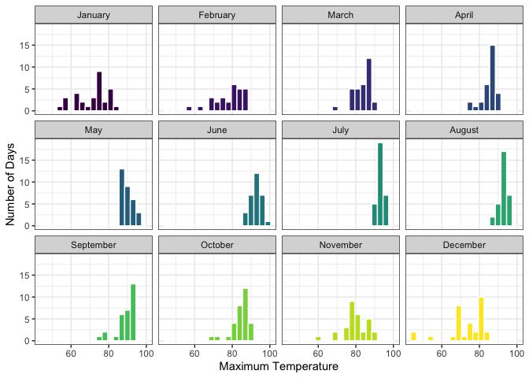
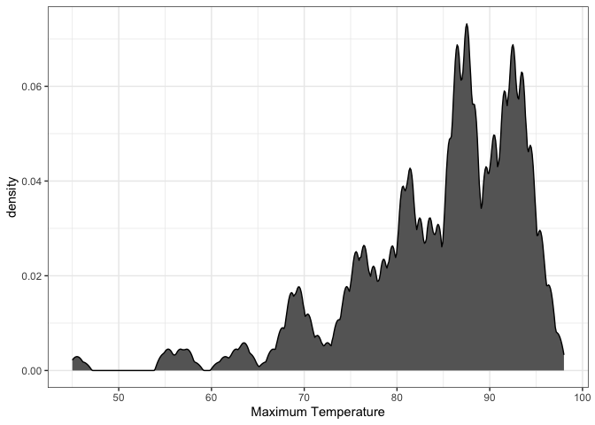
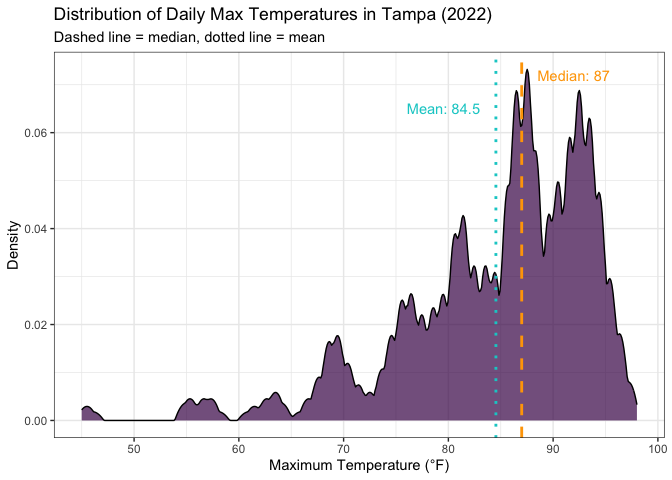
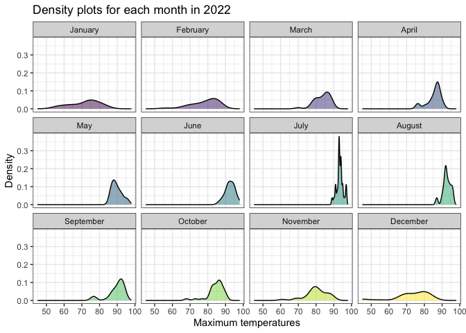
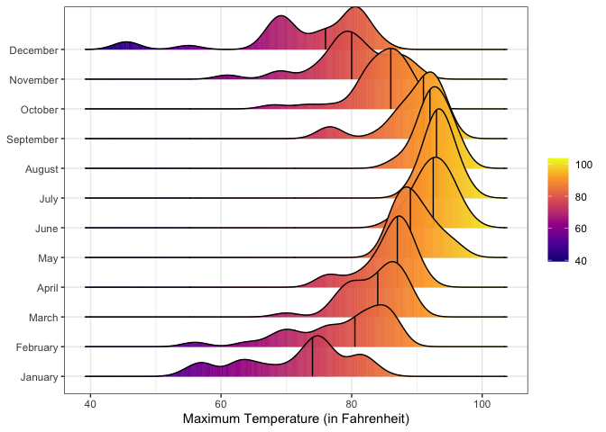
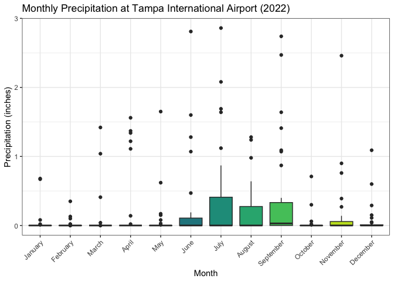
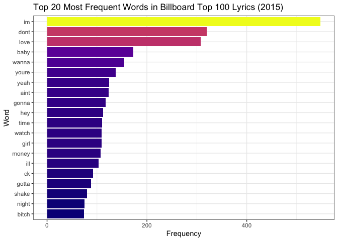

# Data Visualization Project 03


In this exercise you will explore methods to create different types of data visualizations (such as plotting text data, or exploring the distributions of continuous variables).


## PART 1: Density Plots

Using the dataset obtained from FSU's [Florida Climate Center](https://climatecenter.fsu.edu/climate-data-access-tools/downloadable-data), for a station at Tampa International Airport (TPA) for 2022, attempt to recreate the charts shown below which were generated using data from 2016. You can read the 2022 dataset using the code below: 


``` r
library(tidyverse)
weather_tpa <- read_csv("https://raw.githubusercontent.com/aalhamadani/datasets/master/tpa_weather_2022.csv")
# random sample 
sample_n(weather_tpa, 4)
```

```
## # A tibble: 4 × 7
##    year month   day precipitation max_temp min_temp ave_temp
##   <dbl> <dbl> <dbl>         <dbl>    <dbl>    <dbl>    <dbl>
## 1  2022     3     3             0       83       59     71  
## 2  2022    11    15             0       81       68     74.5
## 3  2022     9    15             0       91       75     83  
## 4  2022     7    30             0       97       81     89
```

See Slides from Week 4 of Visualizing Relationships and Models (slide 10) for a reminder on how to use this type of dataset with the `lubridate` package for dates and times (example included in the slides uses data from 2016).

Using the 2022 data: 

(a) Create a plot like the one below:


``` r
weather_tpa %>%
  ggplot(aes(x = max_temp, fill = month_name)) +
  geom_histogram(binwidth = 3, color = "white") +
  facet_wrap(~ month_name) +
  guides(fill = "none") +
  labs(
    x = "Maximum Temperature",
    y = "Number of Days",
  ) +
  theme_bw()
```




Hint: the option `binwidth = 3` was used with the `geom_histogram()` function.

(b) Create a plot like the one below:


``` r
weather_tpa %>%
  ggplot(aes(x = max_temp)) +
  geom_density(kernel = "epanechnikov", bw = 0.5, fill = "gray40", color = "black") +
  labs(
    x = "Maximum Temperature",
    y = "density",
  ) +
  theme_bw()
```



(b1) Here is a revised version of this plot.


``` r
# Calculate median and mean for annotation
med_temp <- median(weather_tpa$max_temp)
mean_temp <- mean(weather_tpa$max_temp)

# Redesigned density plot
weather_tpa %>%
  ggplot(aes(x = max_temp)) +
  geom_density(kernel = "epanechnikov", bw = 0.5, 
               fill = "#440154", color = "black", alpha = 0.7) +
  geom_vline(xintercept = med_temp, linetype = "dashed", 
             color = "orange", linewidth = 1) +
  geom_vline(xintercept = mean_temp, linetype = "dotted", 
             color = "cyan3", linewidth = 1) +
  annotate("text", x = med_temp + 1.5, y = 0.072, 
           label = paste("Median:", round(med_temp, 1)), 
           color = "orange", hjust = 0) +
  annotate("text", x = mean_temp - 1.5, y = 0.065, 
           label = paste("Mean:", round(mean_temp, 1)), 
           color = "cyan3", hjust = 1) +
  labs(
    x = "Maximum Temperature (°F)",
    y = "Density",
    title = "Distribution of Daily Max Temperatures in Tampa (2022)",
    subtitle = "Dashed line = median, dotted line = mean"
  ) +
  theme_bw()
```

<!-- -->


Hint: check the `kernel` parameter of the `geom_density()` function, and use `bw = 0.5`.

(c) Create a plot like the one below:


``` r
weather_tpa %>%
  ggplot(aes(x = max_temp, fill = month_name)) +
  geom_density(alpha = 0.5) +
  facet_wrap(~ month_name) +
  guides(fill = "none") +
  labs(
    x = "Maximum temperatures",
    y = "Density",
    title = "Density plots for each month in 2022"
  ) +
  theme_bw()
```




Hint: default options for `geom_density()` were used. 

(d) Generate a plot like the chart below:


Hint: use the`{ggridges}` package, and the `geom_density_ridges()` function paying close attention to the `quantile_lines` and `quantiles` parameters. The plot above uses the `plasma` option (color scale) for the _viridis_ palette.


``` r
weather_tpa %>%
  ggplot(aes(x = max_temp, y = month_name, fill = stat(x))) +
  geom_density_ridges_gradient(
    quantile_lines = TRUE,
    quantiles = 2,
    scale = 3
  ) +
  scale_fill_viridis_c(option = "plasma", name = "") +
  labs(
    x = "Maximum Temperature (in Fahrenheit)"
  ) +
  theme_bw() +
  theme(axis.title.y = element_blank())
```




(e) Create a plot of your choice that uses the attribute for precipitation _(values of -99.9 for temperature or -99.99 for precipitation represent missing data)_.


``` r
weather_tpa %>%
  filter(precipitation != -99.99) %>%
  ggplot(aes(x = month_name, y = precipitation, fill = month_name)) +
  geom_boxplot() +
  guides(fill = "none") +
  labs(
    x = "Month",
    y = "Precipitation (inches)",
    title = "Monthly Precipitation at Tampa International Airport (2022)"
  ) +
  theme_bw() +
  theme(axis.text.x = element_text(angle = 45, hjust = 1))
```




## PART 2 

> **You can choose to work on either Option (A) or Option (B)**. Remove from this template the option you decided not to work on. 


### Option (A): Visualizing Text Data

Review the set of slides (and additional resources linked in it) for visualizing text data: Week 6 PowerPoint slides of Visualizing Text Data. 

Choose any dataset with text data, and create at least one visualization with it. For example, you can create a frequency count of most used bigrams, a sentiment analysis of the text data, a network visualization of terms commonly used together, and/or a visualization of a topic modeling approach to the problem of identifying words/documents associated to different topics in the text data you decide to use. 

Make sure to include a copy of the dataset in the `data/` folder, and reference your sources if different from the ones listed below:

- [Billboard Top 100 Lyrics](https://raw.githubusercontent.com/aalhamadani/dataviz_final_project/main/data/BB_top100_2015.csv)


``` r
library(tidytext)
library(textdata)
library(plotly)

billboard <- read_csv("https://raw.githubusercontent.com/aalhamadani/dataviz_final_project/main/data/BB_top100_2015.csv")

billboard_words <- billboard %>%
  unnest_tokens(word, Lyrics) %>%
  anti_join(stop_words)
```


``` r
billboard_words %>%
  count(word, sort = TRUE) %>%
  slice_max(n, n = 20) %>%
  ggplot(aes(x = reorder(word, n), y = n, fill = n, text = paste("Word:", word, "<br>Count:", n)))+
  geom_col() +
  coord_flip() +
  scale_fill_viridis_c(option = "plasma") +
  guides(fill = "none") +
  labs(
    x = "Word",
    y = "Frequency",
    title = "Top 20 Most Frequent Words in Billboard Top 100 Lyrics (2015)"
  ) +
  theme_bw()
```




